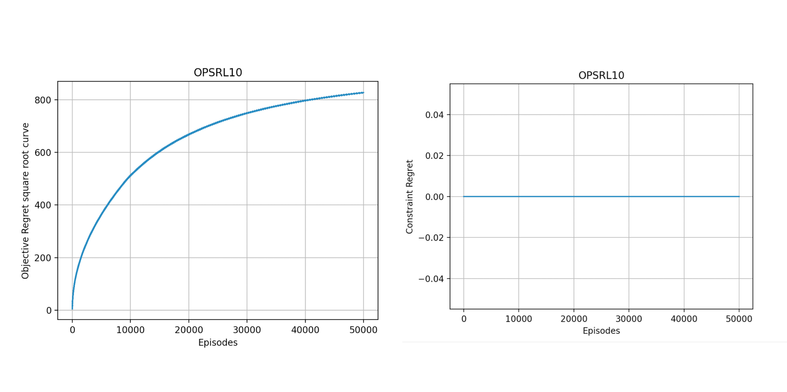
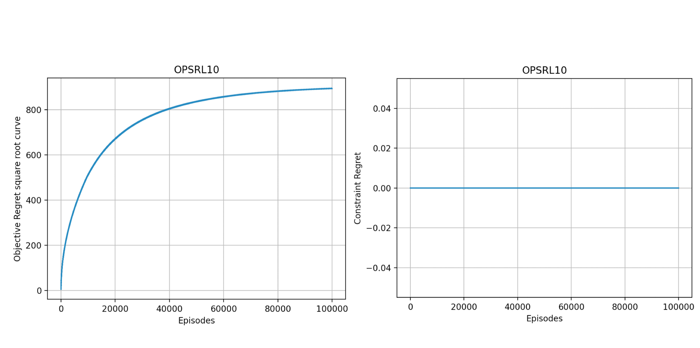
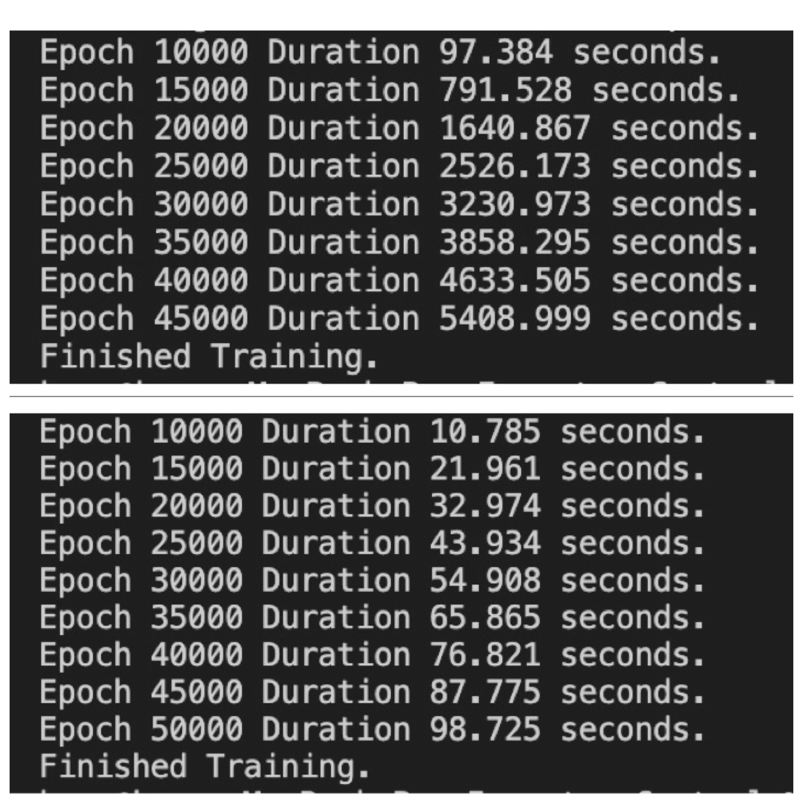

Komo Zhang | 28 Jan 2023


Figures
=======

 </br>

 * epoch = 5e4 
 * Training time = 1.8h
 * Square Objective Regret grow in log scale
<br/>

Experiments and Some Thoughts
=======
*  **Time Complexity**
</br>
 When NUMBER_EPISODES = 1e5, it needs to run almost <font color=pink>4 hours</font> , but it's only based on a simple inventory control environment with 6 states, 6 actions and 7 steps each episode.
 </br>
 One reason is that policy updated each episode after first K0 episodes and solving LP problems require polynomial time complexity.
 </br>
 So I made an experiment, I tried to <font color=pink> fix one policy for about 100 episodes </font>then update it. 
 </br>

 * **<font color=grey>1. Results Comparsion</font>**
 </br>
 There is no difference, the pictures are both the ones above. Below is the fig using fixed method when epoch = 1e5, we can see it grows more slowly and steadily.
 *  
 </br>

 * **<font color=grey>2. Runtime Difference</font>**
 </br>
 There's a huge difference in runtime, for both epoch = 50000.
 </br> Update policy each time = 1.7h.
 </br> Fix the policy for every 100 episodes = 98s with same result. 
 </br>
* 
 </br>

*  **Reward Function**
</br>
Linear reward functions are more limited in real life, I'm trying to gain more knowledge on Optimization.

</br>

Few Errors in Problem Description/Code 
=======
(also shown in code files)
*  **Problem Description**\
In inventory control environment, we want to maximize expected total reward while keeping expected cost under a certain constraint. The paper defined N=6 as the capacity meaning it can store a maximum of 6 item, while in code N equals to 6 means it should range from 0 to 5, thus it's a product inventory control problem with actually 5 items.

*  **ZeroDivisionError** 
```python
opt_policy[s.h.a] = opt_policy[s.h.a] / sum_prob
#lack divide by zero handling, occurred two places when solving LP_extended as above
```

*  **L value**
```python
#L = math.log(6 * N_STATES**2 * EPISODE_LENGTH * NUMBER_EPISODES / DELTA)
#In Dope, the value should be 
L = math.log(2 * N_STATES**2 * EPISODE_LENGTH * NUMBER_EPISODES / DELTA)
```
<br/>

